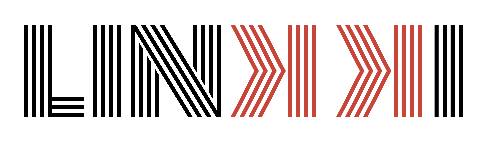
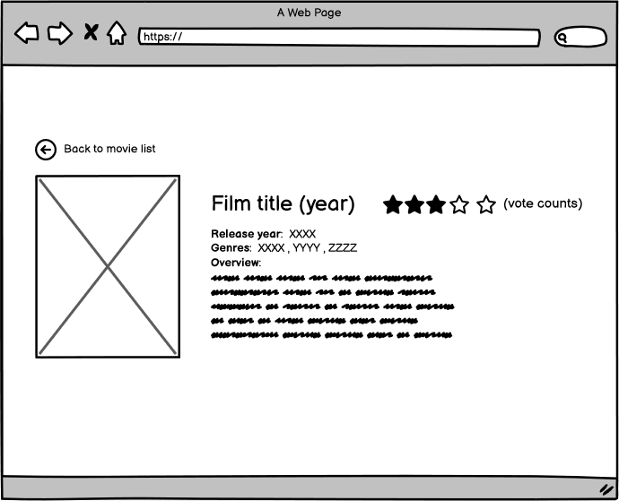

# React + TypeScript + Linkki

**LINKKI** es la plataforma donde puedes encontrar información de tus películas favoritas de **todos** y los **generos**.

### Funcionalidades

En MUVI podrás ordenar las películas por **más recientes** o **más antiguas**
Podrás filtrar las películas por año de estreno y también podrás elegir entre las categorías **drama** y **comedia**
Al hacer click sobre una película serás dirigido a una nueva vista, donde verás información relevante de la película seleccionada, como su título, año de estreno, descripción.

## Tecnologías utilizada

Para la construcción de MUVI se utilizó lo siguiente:

- **React**: Como framework para el desarrollo
- **TypeScript**: Como lenguaje de programación
- **The Movie Database API V3**: Como API para obtener el catálogo de películas

## Diseño y desarrollo

1. **Prototipo de baja fidelidad**: Este diseño fue entregado por el product owner.

2. **Prototipo de alta fidelidad**: Este diseño fue realizado en [figma](https://www.figma.com/file/8hButnUc1WMquz041lfGu5/linkkiTv?type=design&node-id=0%3A1&mode=design&t=JqBSVjgSJZFQiPBz-1).

3. **Desarrollo**: LINKKI se desarrolló en base a los prototipos buscando siempre un diseño intuitivo y fácil
de comprender para el usuario.

No olvides visitar **[LINKKI](https://linkki-react.vercel.app)**