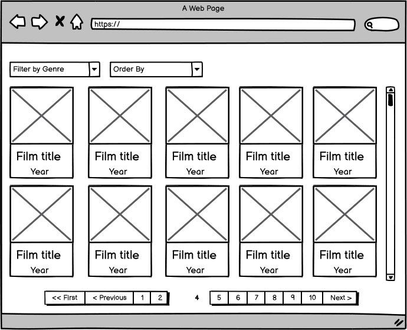

# React + TypeScript + Linkki

**LINKKI** es la plataforma que te ofrece información sobre tus películas favoritas de **todos los tiempos** y de **todos los géneros**.

### Funcionalidades

En LINKKI, disfrutarás de varias funciones prácticas:

    **1. Ordenación Personalizada:** Clasifica las películas según su fecha de estreno, ya sea de las más recientes a las más antiguas, o viceversa.

    **2.Filtrado por Año:** Selección de Género: Refina tus búsquedas seleccionando entre categorías como drama y comedia, asegurándote de encontrar exactamente lo que te apetece.

    **3.Detalles Complejos:** Al hacer clic en una película, serás redirigido a una vista detallada que ofrece información clave, como el título, año de estreno y una descripción, brindándote una visión completa antes de decidir qué ver.
   

## Tecnologías utilizada

En la creación de Linkki se emplearon las siguientes tecnologías:

- **React**: Se utilizó como framework principal para el desarrollo.
- **TypeScript**: Se adoptó como lenguaje de programación para mejorar la calidad y mantenimiento del código
- **The Movie Database API V3**: Se integró como la API principal para obtener el extenso catálogo de películas disponible.

## Diseño y desarrollo

1. **Prototipo de baja fidelidad**: Este diseño fue entregado por el product owner.

2. **Prototipo de alta fidelidad**: Este diseño fue realizado en [figma](https://www.figma.com/file/8hButnUc1WMquz041lfGu5/linkkiTv?type=design&node-id=0%3A1&mode=design&t=JqBSVjgSJZFQiPBz-1).

3. **Desarrollo**: LINKKI se desarrolló en base a los prototipos buscando siempre un diseño intuitivo y fácil de comprender para el usuario.

No olvides visitar **[LINKKI](https://linkki-react.vercel.app)**